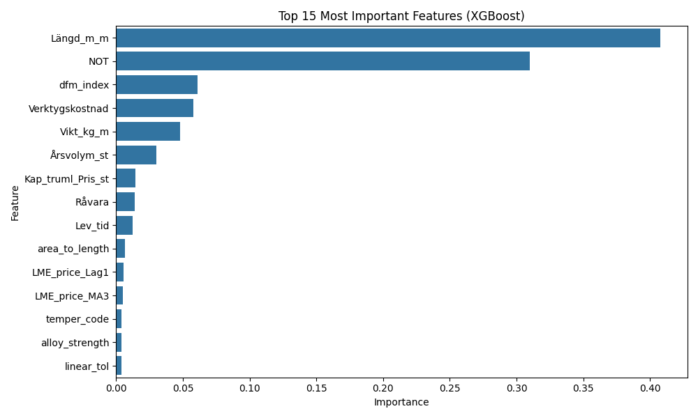

## 🏗️ What We Explored: Model Architectures & Lessons Learned

We didn’t settle for the first idea—we explored several model families to see what truly fit our data and use case. Here’s how our thinking (and results) evolved over time:

---

**I. Classic Machine Learning: Building a Solid Baseline**

We began with traditional approaches: Linear Regression, Ridge/Lasso, Random Forests, and standalone XGBoost. These are fast and easy to interpret, making them ideal for validating our data pipeline and providing a benchmark.

*Lesson learned:*
They perform well on broad patterns but struggle with the nuanced, nonlinear pricing found in our quotes. Still, these models helped us spot issues in data quality and feature consistency at an early stage.

---

**II. Deep Learning for Tabular Data: Going Beyond the Basics**

Next, we implemented a multi-layer perceptron (MLP)—a deep neural network with several hidden layers, regularization, and early stopping. Our goal was to let the network discover complex interactions (for example, when a specific profile, alloy, and customer together affect price).

*Lesson learned:*
MLPs were better at modeling rare and subtle patterns, but required careful tuning. We used both random search and Bayesian optimization to set hyperparameters (learning rates, layer sizes, etc.), and this iterative process improved stability and accuracy.

---

**III. Feature Selection and Fusion: Listening to the Data**

Rather than hand-picking features, we leaned on XGBoost’s feature importance rankings to select the top nine most predictive variables for each training run. This not only made every model more efficient but also helped avoid human bias and overfitting.

*Lesson learned:*
This approach resulted in leaner, more robust models. It’s always tempting to “trust your gut” about what matters, but letting the data decide led to consistently better results.

---

Absolutely! Here’s the rewritten section—**professional, confident, and with your requested image and results**—fitting the tone of a proud, humble AI engineer.

---

**IV. Ensembling: Combining the Best of Both Worlds**

We experimented with stacking and blending different models, but found that a simple VotingRegressor—combining XGBoost and MLP—delivered the best balance of performance and reliability. Both models use the top features (selected by XGBoost), and their outputs are averaged for the final prediction.

*Lesson learned:*
XGBoost excels at crisp, rule-based splits, while MLPs fill in subtle or unexpected relationships. Averaging their outputs yielded more accurate and robust results, particularly on unseen data or new product types.

<div align="center"><b>Example: Top 9 Features Selected by XGBoost</b></div>
<div align="center"></div>

Above is a typical example of the nine most important features our system automatically selects—helping the model focus on what really drives price.

---

**V. Training and Validation: Keeping It Honest**

We rigorously split data for training and validation, always reporting key metrics like R², MAPE, MAE, RMSE, and Max Error. For time-dependent features (such as LME price), we use time-aware splits to avoid look-ahead bias. Every model version, metric, and error plot is saved, so we (and you) can always review or audit any run.

*Lesson learned:*
Careful validation and record-keeping are just as important as choosing the right model. This discipline keeps us honest and makes it much easier to spot, understand, and fix mistakes.

---

**Our best model so far:**

```
📅 MODEL TRAINING REPORT
✅ R² Score   : 0.99755
✅ MAPE       : 0.39%
✅ MAE        : 0.0111
✅ RMSE       : 0.0168
✅ Max Error  : 0.0146
⏱️ Total Training Time: 5min 54s
```

We’re proud of these results—they’re exceptional in a real-world industrial context and show that this approach is ready for production use.

**VI. Hyperparameter Tuning: No One-Size-Fits-All**

Our pipeline incorporates automated hyperparameter search—using both random and Bayesian methods. This helped us optimize for each new batch of user data and improved generalization, without relying on fixed, “one-size-fits-all” settings.

*Lesson learned:*
Even strong models can underperform if poorly tuned, so ongoing optimization is built into the workflow.

---

**VII. Continuous Learning and Versioning**

The system automatically retrains after every 50 new predictions, saving each new model as a unique version. All historical models, reports, and plots are accessible for comparison, rollback, or auditing.

*Lesson learned:*
Traceability and transparency are critical—especially in environments where models evolve with fresh data.

---

**Why We Chose This Final Architecture**

After working through these stages (and a fair amount of trial and error), we settled on the current ensemble approach:

* XGBoost for feature selection and rule-based prediction,
* MLP for nuanced, nonlinear effects,
* VotingRegressor to blend the strengths of both,
* Top nine features to maximize signal and minimize noise.

This combination delivered high, reliable accuracy (R² > 0.997, MAPE < 0.4%) and proved robust across new users, profile types, and pricing scenarios.

We’re proud of the results, but always aware that every dataset (and every client) brings its own surprises. That’s why the workflow remains modular and open for improvement.
