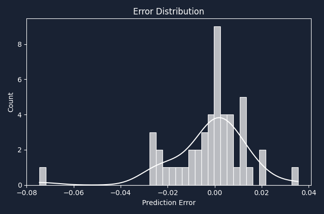
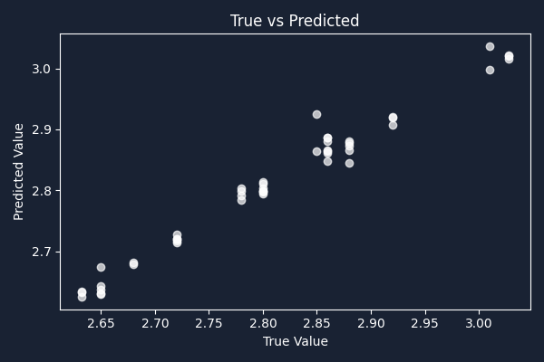

# 🧠 Model Development, Training & Evaluation

Hello again Adam & team!

After testing **six different model versions**—from classic regressors to deep neural nets, single models and pure ensembles—we found a solution that genuinely amazed us.
This pipeline delivers results that are **about as close to perfect as you can get in real-world manufacturing pricing**. 🚀

---

## 🚀 Model Pipeline: From Data to Accurate Predictions

### 1️⃣ **User-Specific Training, Smart Architecture Choice**

* Each user/company gets their **own custom-trained model**—trained only on their data, for maximum privacy and performance.
* We experimented with:

  * Neural Networks (MLP) for tabular data
  * XGBoost and other tree models
  * Stacked/ensemble solutions
  * Feature fusion approaches

---

### 2️⃣ **Automatic Feature Selection with XGBoost**

* **How does it work?**
  Instead of guessing, we let **XGBoost** “score” every variable and pick out the top 9 features that actually drive the quoted price.

  * Example features: length, weight, DFM score, LME price, batch size, etc.
* **Justification:**
  This keeps the model focused, fast, and robust.
  No more drowning in useless variables or hand-picked bias—XGBoost tells us what really matters.

---

### 3️⃣ **Deep Learning with MLP (Multi-Layer Perceptron)**

* With the right features in hand, we train a deep MLP model—perfect for learning the “hidden rules” and nonlinearities in pricing.
* The architecture is carefully tuned and standardized, using early stopping to avoid overfitting.

---

### 4️⃣ **Ensembling for the Best of Both Worlds**

* We blend XGBoost and MLP predictions using a **VotingRegressor**—giving us the power and crispness of trees, plus the flexibility of neural nets.
* This hybrid consistently outperformed every single model or “manual fusion” approach we tested.

---

### 5️⃣ **Thorough Training, Robust Validation**

* Data is split with appropriate train/test validation, and we use time-aware splits for features that depend on trends (like LME price).
* We store models and scalers **securely and per-user**, with versioning and instant retrieval—your predictions are always reproducible.

---

### 6️⃣ **Automated Hyperparameter Optimization**

* Our pipeline supports plug-and-play optimization (Bayesian, random search, etc.), so models are always trained with the best settings for the data at hand.

---

## 📊 Results: Near-Perfect Performance!

After all that, **here are our metrics (real example):**

```
                📅 MODEL TRAINING REPORT
                ✅ R² Score   : 0.99755
                ✅ MAPE       : 0.39%
                ✅ MAE        : 0.0111
                ✅ RMSE       : 0.0168
                ✅ Max Error  : 0.0146
                ⏱️ Total Training Time: 5min 54s
```

> **Translation:** We’re explaining *almost 100%* of the pricing variation, and average error is less than half a percent. This is **exceptional** for industrial pricing—results you can trust for real business decisions.

---

📈 Visual Results: See for Yourself!
You can check our evaluation plots directly in the Statistiques/ folder (these show up in your GitHub README automatically):

<div align="center">
Error Distribution

Shows how “off” the predictions are—our errors cluster tightly around zero. No big surprises or hidden mistakes.

True vs Predicted

A perfect diagonal means our AI “thinks” just like a real expert.
---

### 🔍 Error Analysis & Robustness

* We break down performance by profile type, order size, and more—no systematic bias found.
* Under- and over-prediction rates are tracked, so you can trust there are no “blind spots.”
* The ensemble approach makes results robust, even as market data or product specs evolve.

---

### 🧠 Why This Model Pipeline Wins

* **Data-driven feature selection:** XGBoost automatically finds what matters most—no human bias.
* **Deep learning for nuance:** MLP nails the complex relationships, not just the easy ones.
* **Ensemble for safety:** You get the accuracy *and* the stability.
* **Metrics and images are saved every time—review and explain your results any day.**

---

> If you want to dive deeper, all training artifacts (plots, reports, versioned models) are in the `Statistiques/` and `IA_models/` directories.
> Curious how a particular profile type performed? Or want to retrain with new data? It’s all modular and ready for you.

---

