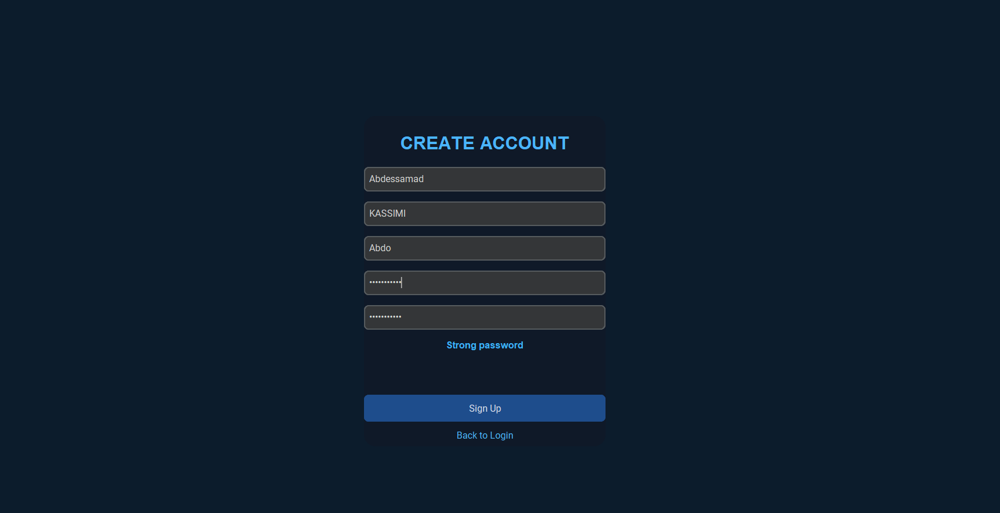
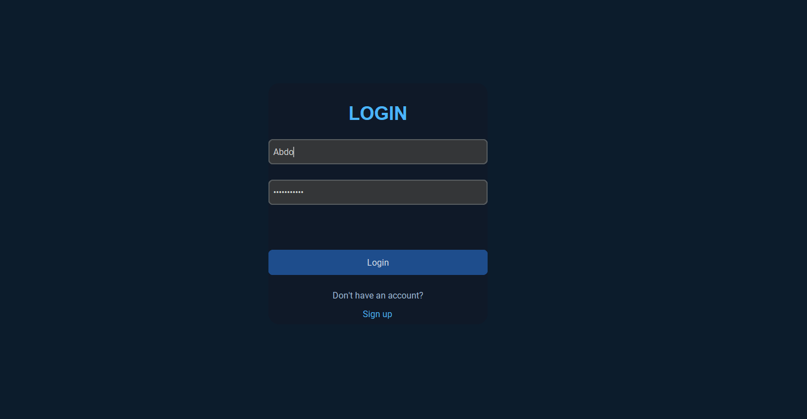
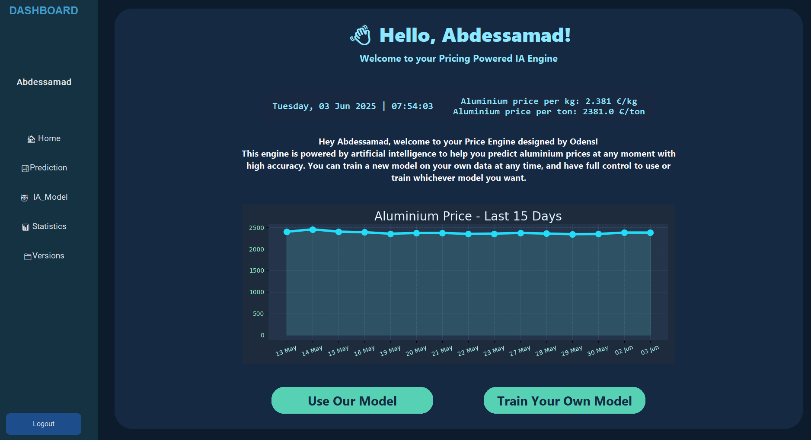
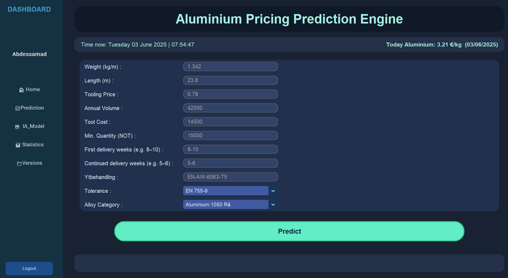
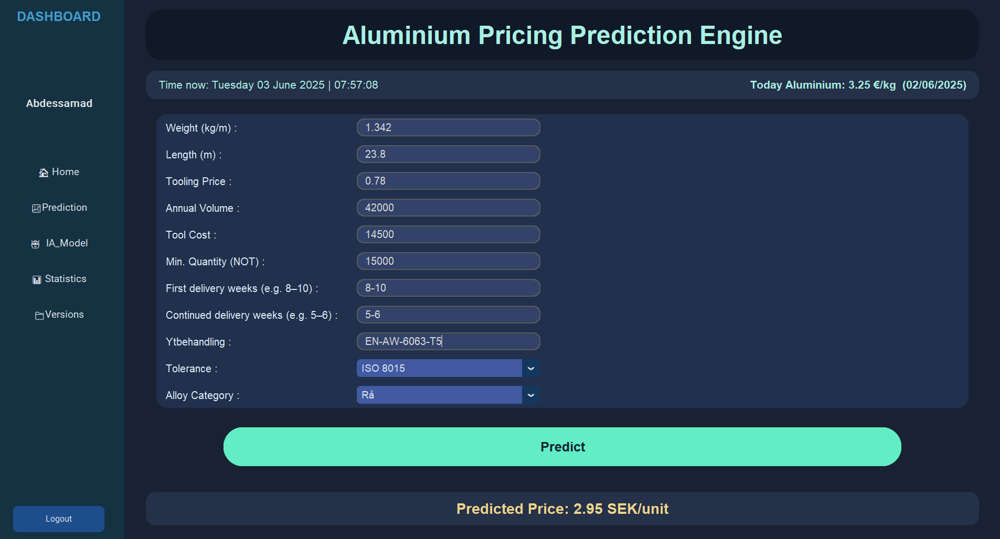
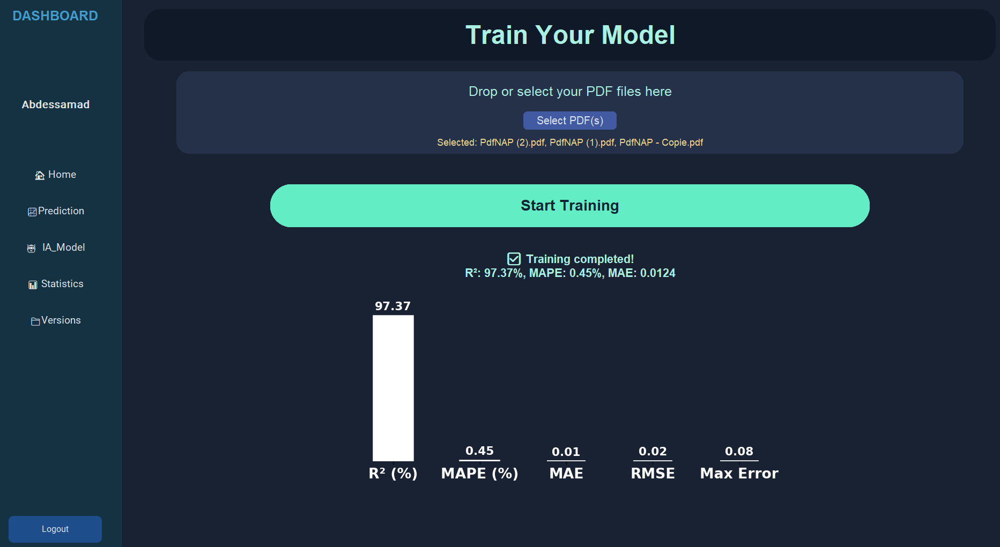

Heeey Adam, hey team! Welcome! 🎉

It’s the first time we “meet”—not in the real world, but at least in the digital one!
Here, I’m going to walk you through how to use your new platform. For every folder, you’ll find a **global description**, sample scripts, and data: from data processing, to model training, to managing your models. Everything you need to understand how we built this wonderful platform (and to master it yourself)!

The magic starts now… 🪄✨

---

## Step 1: Sign Up & Create Your Personal Space

The first thing you’ll do is **sign up**—that creates a secure, personal space just for you!
We take care of all your data, models, and everything else related to your account. Don’t worry: everything is safely encrypted and isolated.
When you’ve signed up, simply use your username and password to log in whenever you want.

---

## Step 2: Enter Your Pricing AI Engine

Once you log in, you’ll land on your personal dashboard.
Here, you’ll see today’s **live aluminium price**, updated every time you visit, plus a chart for the last 15 days—so you always have the latest market info right in front of you.

If it’s your first visit, you have a choice:

* **Use our pre-trained model** (quick, just click and predict!)
* **Train your own model** on your own data (for full control and customization)

---

## Step 3: Predict Prices Instantly

Welcome to the most exciting part: **real-time price prediction**!
Just fill in the fields—dimensions, batch size, alloy, or whatever specs you want—and click predict.
Your AI model does the heavy lifting and gives you an instant, ultra-accurate price.

---

## Step 4: Train & Retrain Like a Pro

Here’s where the AI really shines (trust me, it’s even better than ChatGPT for pricing 😉).
You can **upload your own data** (PDF quotes only—no messy Excel files), and the system will handle all the data processing, feature engineering, and model training for you.
Every time you predict a price, we keep track. When you reach 50 new predictions, the platform **automatically retrains your model** in the background—so you’re always working with the most up-to-date AI.

---

## Step 5: Check Your Stats & Evaluate Models

This is your “mission control” for AI performance!
You’ll see the key metrics for every model you train—accuracy, error, and more—plus easy-to-understand charts.
Didn’t like the latest model? No problem, we make it easy to roll back or try again.

---

## Step 6: Manage All Your Model Versions

The **Versions page** is your archive and control center:

* Check all the models you’ve ever trained
* Promote your favorite version for live predictions
* Delete old ones you don’t need anymore

You have full control, every step of the way.

---

## Need More Info? Just Explore!

Now, you might be wondering “How did they build all this?”
Just scroll through the folders—every section has a full, detailed description, with everything you’ll want to know (and probably a few things you didn’t know you wanted!).

We made sure you always have the **“how” and “why”** right at your fingertips.
Enjoy exploring, experimenting, and mastering your very own AI-powered pricing engine. Odens-style! 🚀

---

If you have any questions or want to dive deeper into the code or data, just reach out.
Welcome aboard—and have fun!
