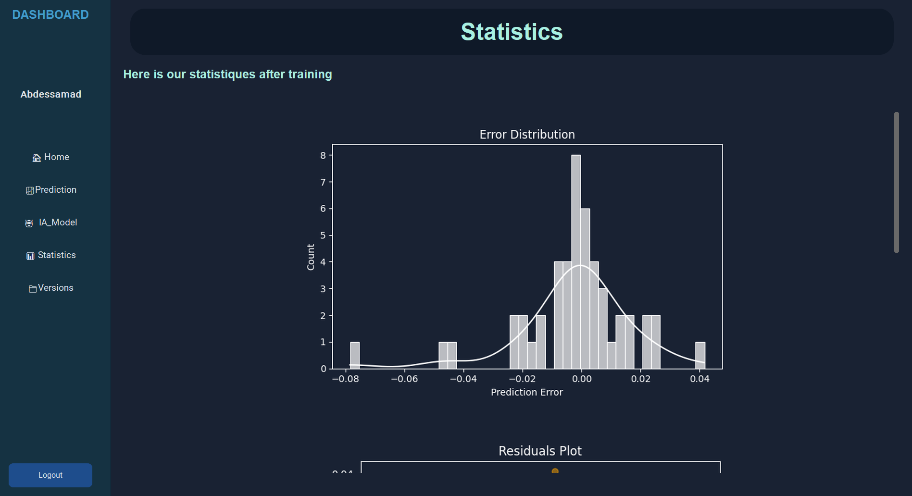

---

# 👋 Hey Adam, hey team! Welcome!

It’s the first time we’re meeting—not in real life, but at least here in the digital world!
Get comfy, because I’m about to show you how to use our wonderful Odens Pricing Platform. In every folder you’ll find clear descriptions, sample scripts, and demo data—from raw data processing all the way to AI model training and management. Scroll around and explore—it’s all there!

**The magic starts now… 🪄✨**

---

## 1️⃣ Sign Up & Create Your Space

First step? Hit “Sign Up!”
Create your account—it’s super quick. Behind the scenes, we make a **private, secure workspace just for you**: all your data, models, predictions, and AI wizardry will be kept safe and sound. 🔒

---

## 2️⃣ Login & Home Sweet Home

Once you’ve got your login, just enter your username and password—boom, you’re in!

---

## 3️⃣ The Home Page: Real-Time Aluminium Prices

Welcome to the pricing engine HQ!
Right on your dashboard you’ll see the **latest aluminium price** (live from the web, updated every day) and a cool chart of the last 15 days. No need to Google anything—your app keeps you in the know. 📈

If it’s your **first visit**, we’ll give you two big options:

* **Use our pre-trained model** (quick start)
* **Train your own AI model** (if you’re feeling like a scientist)

---

## 4️⃣ Instant Price Prediction: Fill in the Blanks!

Now for the fun part—
On the prediction page, just fill in the blanks (material, length, batch size, etc.) and hit predict.
Our AI will give you a price in real time—faster than a coffee break! ☕⚡

---

## 5️⃣ Bring Your Own Data (BYOD—Because You’re Fancy)

Ready to go pro?
You can upload your own data (PDF quotes) and let the platform do all the work:
From data processing to AI model training, it’s all automated.

Every price you predict is saved—and when you’ve predicted 50 new quotes, we retrain your model automatically, so you’re always using the latest data.

It’s like your AI gets smarter while you sleep—
honestly, sometimes we think it’s even smarter than ChatGPT or DeepSeek haha 😴🤖💥

---

## 6️⃣ Statistics: Check Your AI’s Report Card

Head to the statistics page any time to check your model’s performance—accuracy, error, all the juicy details.
Not happy with the latest model? No problem, we keep every version you train, so you can always go back or compare.

---

## 7️⃣ Model Version Control: You’re the Boss

Every version of your AI model is listed here.
Want to **promote** a model to “active”? Go for it.
Want to **delete** an old one? One click.
You’ve got full control—think of it as your personal army of AI assistants, ready whenever you need them! 🦾

---

## 🎉 Explore the Platform—It’s All Documented

Now, you might be wondering:
*“How the heck did you build all this?”*

Easy! Just scroll through the folders. Every section has detailed explanations, sample code, and example data, so you can understand exactly how everything works, from raw PDF extraction to AI magic.

We’ve even added a little Odens touch of humor (and maybe a meme or two), so you’ll never get bored—even if you’re deep in the code. 😄

---

# 🚀 Ready to dive in?

Just sign up, start playing around, and let your AI journey begin.
And remember—if you ever get lost, each folder’s got a mini-guide to bring you back on track.

**Have fun, learn lots, and may your prices always be accurate!**
— The Odens Team 🤝✨

---
